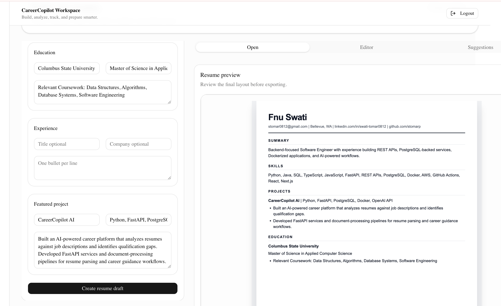
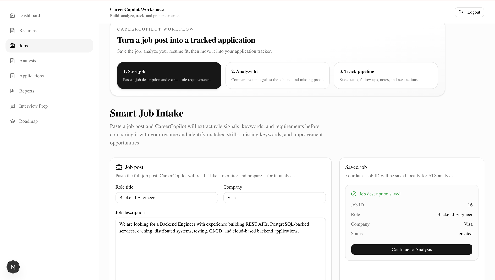
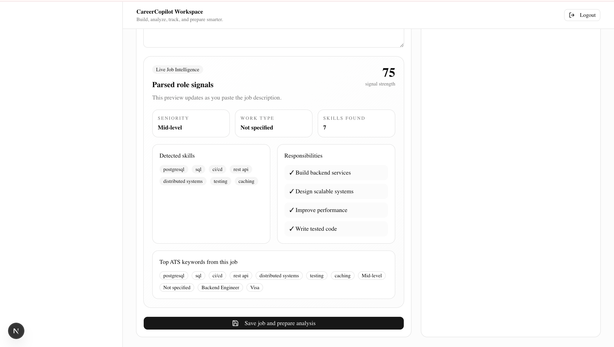
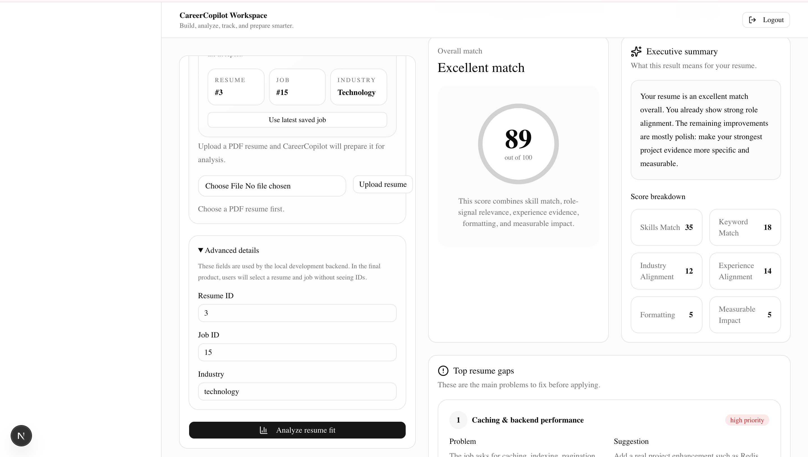
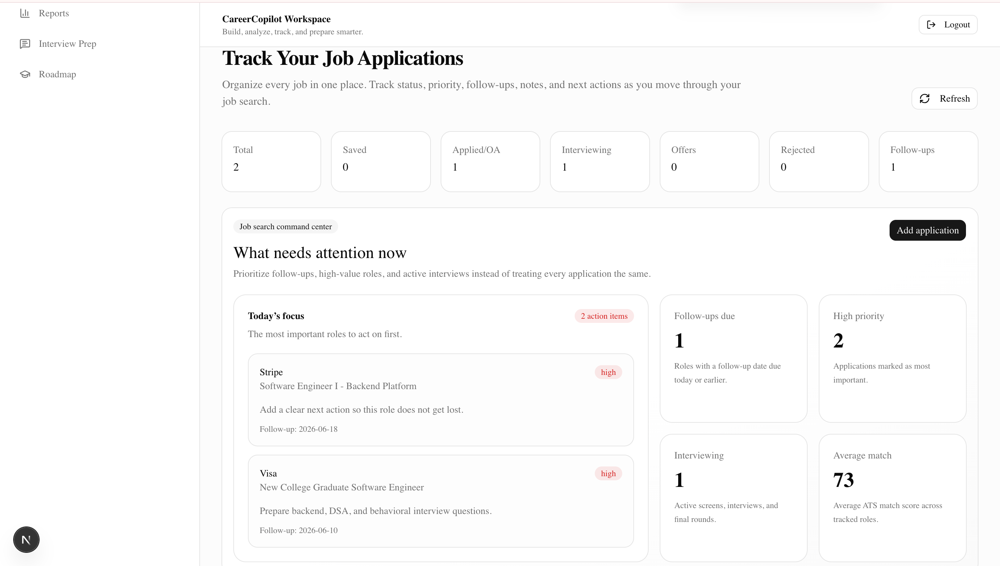

# CareerCopilot AI

CareerCopilot AI is a full-stack AI-powered career platform that helps candidates turn resumes and job descriptions into ATS analysis, resume improvement guidance, job-fit insights, and a structured application pipeline.

It is designed as a job-search operating system: build or upload a resume, paste a job description, analyze fit, identify gaps, improve your resume strategy, and track every application through a pipeline.

---

## Product Screenshots

### Dashboard

### Resume Template Gallery

### Resume Builder

### Smart Job Intake

### Live Job Intelligence

### ATS Analysis Report

### Application Pipeline

---

## Features

### Resume Builder

- Professional resume template gallery
- Resume preview experience for multiple resume styles
- Resume customization controls for template, font, spacing, and accent color
- Resume upload and parsing flow for existing PDF resumes
- Resume-builder workflow designed for job applications and ATS readability

### Smart Job Intake

- Job description input and parsing workflow
- Role, company, location, and source tracking
- Live job intelligence panel for extracted role signals
- Detected skills, responsibilities, seniority, work type, and ATS keywords
- Saved job flow that connects directly into analysis

### ATS Analysis

- Resume-to-job match scoring
- Overall match classification
- Executive summary of candidate fit
- Score breakdown across key hiring categories
- Resume gaps and improvement recommendations
- Priority actions for improving job alignment

### Applications Pipeline

- Job Search Command Center for daily job-search focus
- Smart filters by keyword, status, and priority
- Kanban-style application pipeline grouped by stage
- Follow-up tracking and next-action visibility
- Detailed application list for notes, links, cleanup, and status changes
- Add Application modal for a cleaner dashboard experience

---

## Current Product Flow

Dashboard
→ Resume Builder / Resume Upload
→ Smart Job Intake
→ ATS Analysis
→ Application Pipeline

CareerCopilot AI is built around a complete candidate workflow, not a single resume tool.

---

## Tech Stack

### Frontend

- Next.js
- React
- TypeScript
- Tailwind CSS
- shadcn/ui-style components
- Lucide icons

### Backend

- FastAPI
- Python
- SQLAlchemy
- Pydantic
- PostgreSQL
- Alembic migrations

### Infrastructure and Tools

- Docker
- Docker Compose
- Git and GitHub
- REST APIs
- Local frontend/backend development workflow

---

## Backend API Areas

CareerCopilot AI is organized around core product modules:

- `/resumes`
- `/job-descriptions`
- `/analysis`
- `/applications`

Key backend capabilities include:

- Resume upload and parsing
- Job description upload and intake
- ATS-style score generation
- Application creation, update, delete, and dashboard summary
- PostgreSQL-backed persistent storage

---

## Architecture

Frontend: Next.js + React + TypeScript  
↓ REST API calls  
Backend: FastAPI + Pydantic + SQLAlchemy  
↓ ORM models and migrations  
Database: PostgreSQL

The application separates user-facing product workflows from backend API and database layers, making it easier to extend with AI services, authentication, analytics, deployment, and reporting.

---

## Local Development

### 1. Clone the repository

    git clone https://github.com/stomarp/careercopilot-ai.git
    cd careercopilot-ai

### 2. Start backend services

    cd backend
    docker compose up -d

### 3. Run backend

    source .venv/bin/activate
    uvicorn app.main:app --reload

### 4. Run frontend

Open a new terminal:

    cd frontend
    npm install
    npm run dev

Frontend usually runs on:

    http://localhost:3000

Backend usually runs on:

    http://localhost:8000

---

## Why This Project Matters

CareerCopilot AI demonstrates full-stack software engineering and product thinking across a realistic job-search workflow.

It shows experience with:

- Backend API design
- Database modeling
- Resume and job-description parsing
- ATS-style scoring logic
- Product dashboards
- Frontend state management
- User workflow design
- Dockerized local development
- End-to-end feature delivery

---

## Roadmap

Planned upgrades:

- AI-generated resume improvement suggestions
- Interview preparation module
- Personalized learning roadmap based on skill gaps
- Report export as PDF
- Authentication and user accounts
- Production deployment
- Backend test coverage
- GitHub Actions CI
- RAG/vector search for resume and job memory

---

## Resume-Ready Project Summary

Built CareerCopilot AI, a full-stack AI career platform using FastAPI, PostgreSQL, Docker, Next.js, and TypeScript that parses resumes and job descriptions, generates ATS-style match analysis, identifies resume gaps, and tracks job applications through a Kanban-style pipeline.

---

## Project Status

CareerCopilot AI is actively under development. The current version includes resume builder, smart job intake, ATS analysis, and application pipeline workflows.

