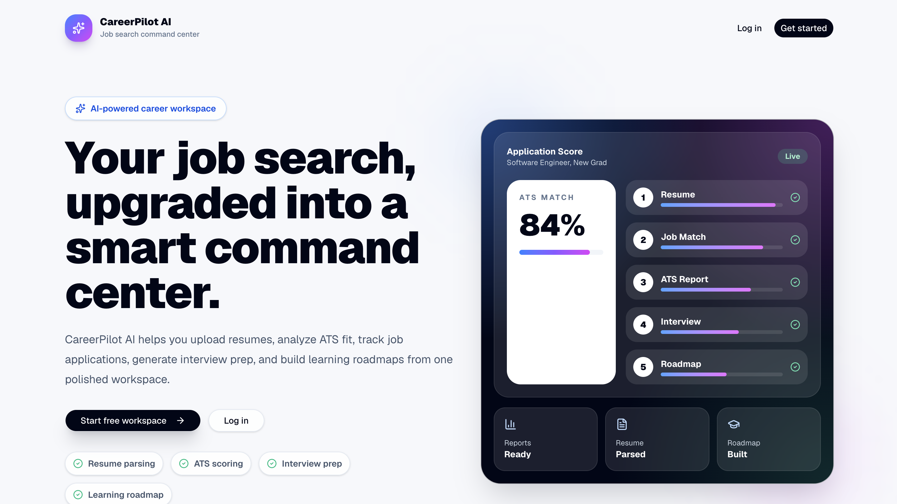
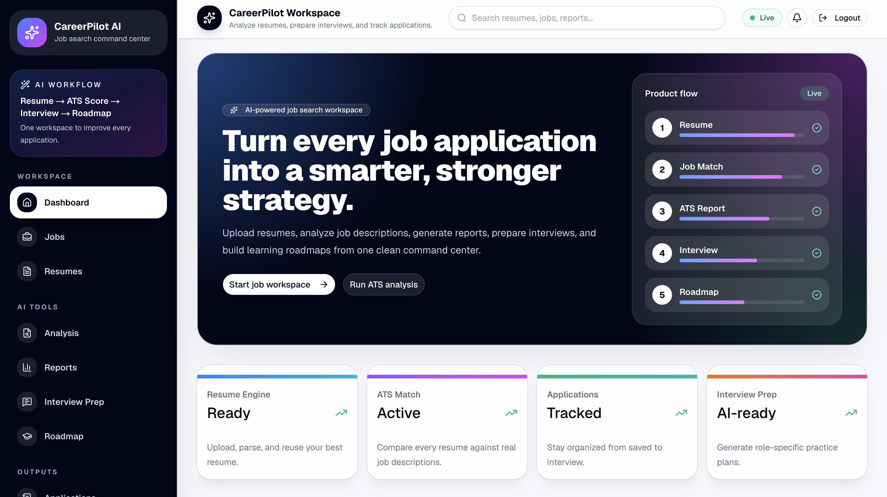
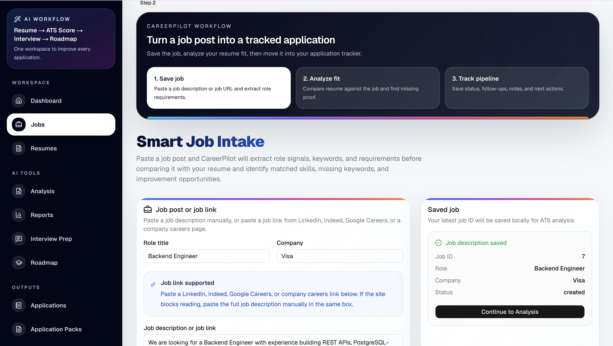
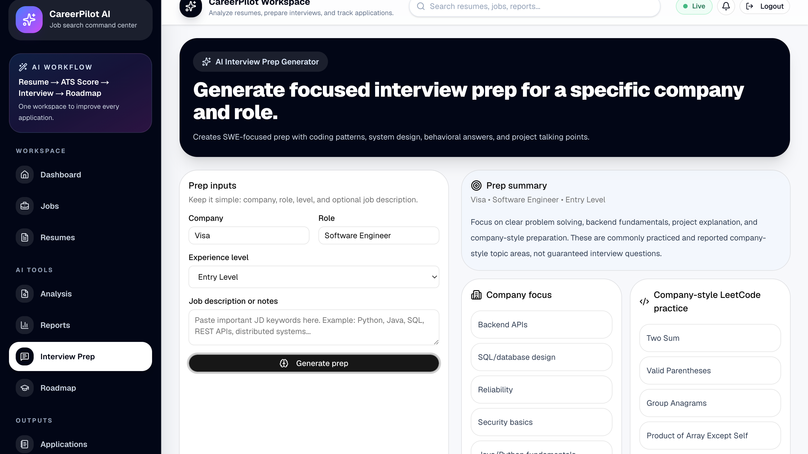
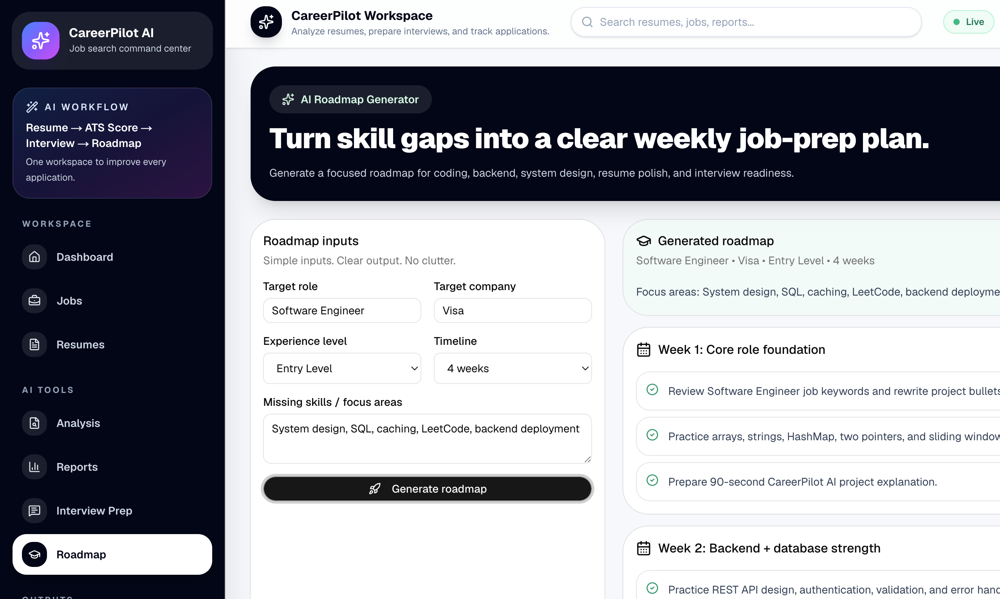
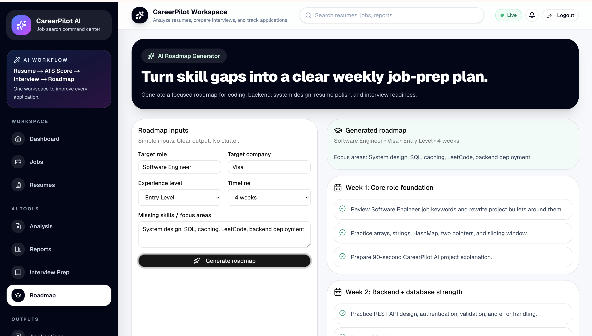
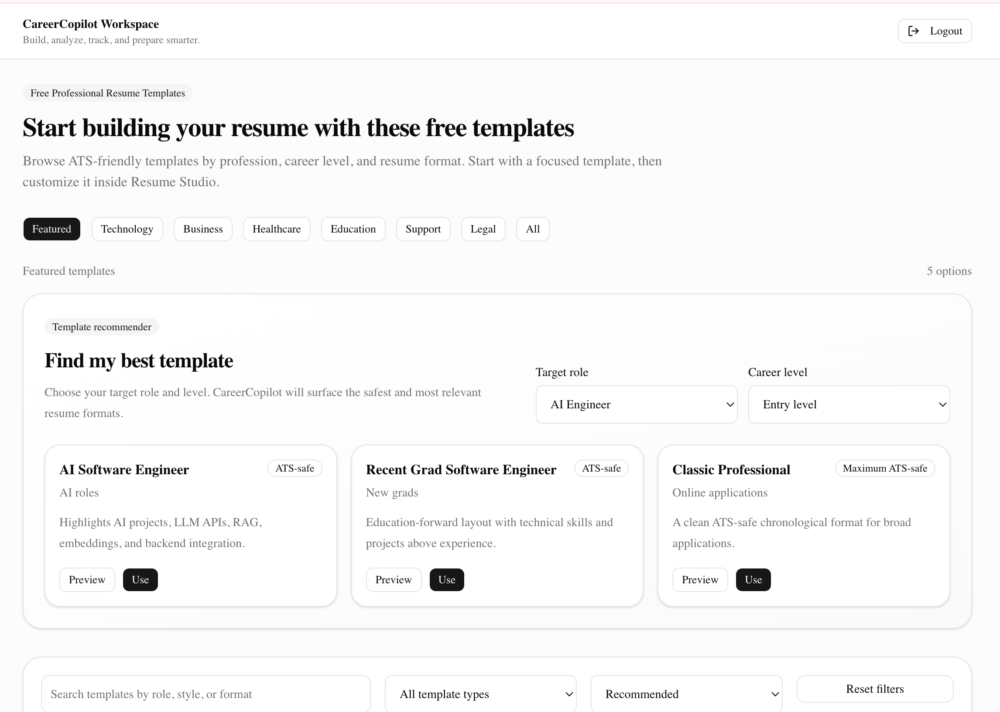

# CareerPilot AI

Live Demo: https://careerpilot-live.vercel.app
GitHub: https://github.com/stomarp/careerpilot-ai

CareerPilot AI is a full-stack AI-powered job-search command center that helps candidates move from resume and job description to a complete application strategy.

It combines resume upload, job intake, ATS analysis, AI resume optimization, interview preparation, learning roadmaps, exports, saved application packs, and application tracking into one workflow.

## Screenshots

### Landing Page

### Dashboard

### Smart Job Intake

### Interview Prep Generator

### Roadmap Generator

### Export Center

### Resume Templates

## Product Flow

Dashboard  
→ Resume Upload / Resume Builder  
→ Job Intake  
→ Guided Job Workspace  
→ ATS Analysis  
→ AI Resume Optimizer  
→ Interview Prep  
→ Learning Roadmap  
→ Export Center  
→ Application Packs  
→ Applications Tracker

## Core Features

### Resume Workflow

- Upload PDF/DOCX resumes
- Parse resume text
- Store user-owned resume records
- Resume builder and template gallery

### Job Intake

- Save job descriptions
- Capture title, company, and job text
- Store job records for later analysis
- Use saved jobs inside the guided workspace

### Guided Job Workspace

- Select saved job from dropdown
- Select uploaded resume from dropdown
- Run the full AI workspace without manually entering IDs
- Generate ATS match, optimizer, interview prep, roadmap, and pipeline strategy

### ATS Analysis

- Resume-to-job match score
- Matched skills
- Missing skills
- Keywords
- Priority actions
- Candidate fit summary

### AI Resume Optimizer

- Job-specific resume strategy
- Section feedback
- Suggested bullet improvements
- Project enhancement ideas
- Truthfulness warning so users do not add fake experience

### Interview Prep

- Role-specific technical questions
- Behavioral questions
- Company-aware prompts
- Answer hints
- Practice priorities

### Learning Roadmap

- Weekly plan
- Daily plan
- Skill gap learning path
- Portfolio project actions
- Interview preparation actions

### Export Center

- Export full application packs
- Export analysis, optimizer, interview prep, roadmap, or recruiter note
- Copy to clipboard
- Download as Markdown
- Print or save as PDF
- Save output as a persistent Application Pack

### Application Packs

- Save generated career artifacts
- Reopen saved packs later
- Search packs
- Copy, download, print, or delete packs

### Applications Tracker

- Track job applications
- Manage status, priority, follow-up date, notes, and next actions
- Use pipeline-style workflow for job search organization

## Tech Stack

### Frontend

- Next.js
- React
- TypeScript
- Tailwind CSS
- shadcn-style UI components
- Lucide icons

### Backend

- FastAPI
- Python
- SQLAlchemy
- Pydantic
- PostgreSQL
- Alembic migrations

### Tools

- Docker
- GitHub Actions
- REST APIs
- AI provider integrations
- Makefile-based local workflow

## API Areas

- /resumes
- /jobs
- /analysis
- /interview
- /learning-roadmap
- /application-packs
- /applications
- /resume-builder
- /auth
- /health
- /ready

## Local Development

### Backend

cd backend
cp .env.example .env
python -m venv .venv
source .venv/bin/activate
pip install -r requirements.txt
alembic upgrade head
uvicorn app.main:app --reload

Backend:

http://127.0.0.1:8000

### Frontend

cd frontend
cp .env.local.example .env.local
npm install
npm run dev

Frontend:

http://localhost:3000

## Useful Commands

make check-env
make migrate
make test
make build
make demo-check

## Demo Flow

1. Upload a resume
2. Save a job description
3. Open Job Workspace
4. Select saved job and resume
5. Run AI workspace
6. Review ATS match, optimizer, interview prep, and roadmap
7. Open Export Center
8. Save Application Pack
9. Reopen it from Application Packs
10. Track the application in Applications

See:

- docs/DEMO_FLOW.md
- docs/DEPLOYMENT.md
- docs/PRODUCTION_READINESS.md

## Why This Project Matters

CareerPilot AI demonstrates end-to-end software engineering and product thinking:

- Backend API design
- Database modeling
- AI-assisted workflows
- User-owned persistent data
- Full-stack product architecture
- Candidate-focused UX
- Exportable artifacts
- Deployment readiness
- Production-style project organization

## Resume-Ready Project Summary

Built CareerPilot AI, a full-stack AI job-search command center using FastAPI, PostgreSQL, SQLAlchemy, Alembic, Next.js, TypeScript, and AI APIs. The platform parses resumes and job descriptions, generates ATS match analysis, provides AI resume optimization, creates interview prep and learning roadmaps, exports application packs, saves generated artifacts, and tracks job applications through a candidate pipeline.

<!-- DEPLOYMENT_START -->
## Live Project

- Live App: https://careerpilot-live.vercel.app
- GitHub Repo: https://github.com/stomarp/careerpilot-ai
- Backend API: https://careercopilot-api.onrender.com

## Deployment

CareerPilot AI is deployment-ready as a production-style full-stack app.

Production stack:

- Frontend: Vercel Next.js app
- Backend: Render FastAPI web service
- Database: Render PostgreSQL
- Migrations: Alembic runs automatically during backend startup

Production files:

- render.yaml
- frontend/vercel.json
- backend/.env.production.example
- frontend/.env.production.example
- scripts/smoke_production.sh
- docs/LAUNCH_RUNBOOK.md

Backend deployment on Render:

Build command:

    cd backend && pip install --upgrade pip && pip install -r requirements.txt

Start command:

    cd backend && alembic upgrade head && uvicorn app.main:app --host 0.0.0.0 --port $PORT

Required Render environment variables:

    ENVIRONMENT=production
    APP_ENV=production
    LOG_LEVEL=info
    FRONTEND_URL=https://careerpilot-live.vercel.app
    BACKEND_CORS_ORIGINS=https://careerpilot-live.vercel.app,http://localhost:3000

Render injects:

    DATABASE_URL
    SECRET_KEY

Frontend deployment on Vercel:

Set Vercel root directory:

    frontend

Required Vercel environment variables:

    NEXT_PUBLIC_API_BASE_URL=https://careercopilot-api.onrender.com
    NEXT_PUBLIC_APP_NAME=CareerPilot AI
    NEXT_PUBLIC_APP_ENV=production

Production smoke test:

    API_URL=https://careercopilot-api.onrender.com WEB_URL=https://careerpilot-live.vercel.app ./scripts/smoke_production.sh

Expected result:

    Production smoke test passed

Deployment docs:

    docs/DEPLOYMENT_GUIDE.md
    docs/LAUNCH_RUNBOOK.md

Full launch checklist:

    docs/LAUNCH_RUNBOOK.md
<!-- DEPLOYMENT_END -->
